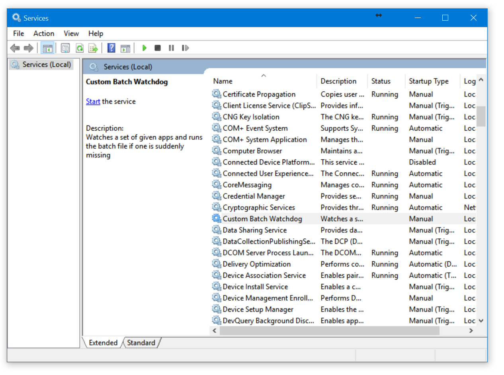
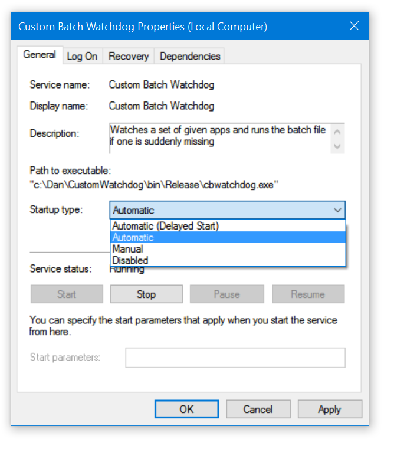
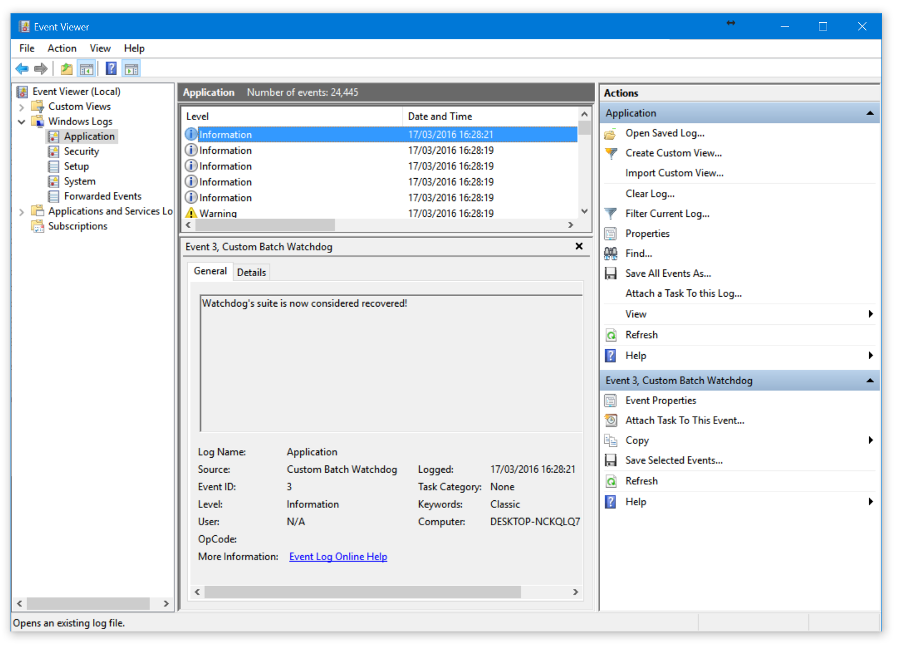

# Custom Batch Watchdog (```cbwatchdog```)

The Windows system service ```Custom Batch Watchdog``` (```cbwatchdog```) watches a list of processes to be in-place and running, and executes a batch file if one or more are missing. Service is configured via ```cbwatchdog.json``` which must be put into ```%windir%/System32``` (which usually is ```C:/windows/system32```). The service is essentially a simple state machine. Every ```healthCheckInterval``` milliseconds it checks whether all the appplications with names from a list ```processes``` are presented. If one or more are not running at a moment of check, the service executes ```recoveryBatch```. After syncronously running ```recoveryBatch``` service starts to check at every ```recoveryPauseInterval``` milliseconds whether the whole list of apps is back again. It checks it in a loop for at most ```criticalCounts``` times, waiting ```recoveryPauseInterval``` milliseconds each time, and, if waiting after ```criticalCounts``` times is still unsucessful, it executes ```recoveryBatch``` again, and the loop repeats.

### How to set it up


1. Compile a tool from sources. It is a C# system service. Do not run it from Visual Studio.
2. Prepare the sample configuration. This configuration bundled with source code simply keeps ```notepad``` run forever. This is the most annoying thing that may ever happen in your life! So, just copy ```cbwatchdog.json``` and ```cbwatchdog.bat``` to ```%windir%/System32``` (which usually is ```C:/windows/system32```).
3. For instance, we compiled the code to ```c:\Dan\CustomWatchdog\bin\Release\```. Open command prompt with Admin rights ("Start" -> cmd -> Right Click -> "Run as Administrator") and navigate to this directory (```cd c:\Dan\CustomWatchdog\bin\Release```).
4. Install ```cbwatchdog.exe``` as a service with a command: ```installutil cbwatchdog.exe```. As a result you should get a message ```The Commit phase completed successfully. The transacted install has completed.```
5. Navigate to a services management console (```Win+R``` -> ```services.msc``` -> ```Enter```) and hit ```Start the service```: 
6. Notice that ```notepad``` is now running. Try to close ```notepad``` and see what happens.

Optional:
If you don't to use the ```cbwatchdog.json``` file in ```%windir%/System32``` run the command ```net start CustomBatchWatchdog /"C:\Watchdog\cbwatchdog.json" /CBWatchDog```. This will update the config file location to ```C:\Watchdog\cbwatchdog.json``` and run the service at the same time. The second argument here is optional, it specifies the name of Application Event name. If not specifiled the log name would be "Custom Batch Watchdog" by default.


The service is installed with ```Manual``` type of startup. In order to have the watchdog fire up at a system startup, change the startup type to ```Automatic``` by right-clicking on a service and choosing the type: 

Now, if you restart Windows, the first thing you'll see after reboot is ```notepad```.

### Diagnostics

The watchdog writes all events to a system log. Here is what you typically see via Windows Event Viewer:



### Elevated mode to run recovery script

After Windows Vista, system servcies can no longer start processes with GUI. In order to have watched processes with GUI, ```cbwatchdog``` is extended with a feature to run the recovery batch in an elevated (full-Admin rights) mode with all limitations supressed. To enable it set ```elevatedModeRecovery``` to ```true```.

### Defaults and obligatory options

The full structure of ```cbwatchdog.json``` is as following:

```json
{
  "healthCheckInterval": "10000",
  "recoveryExecutionTimeout": "300000",
  "noConsoleForRecoveryScript": "false",
  "criticalCounts": "10",
  "recoveryItems": [
    {
      "recoveryBatch": "cbwatchdog.bat",
      "scDatabase": "default",
      "overrideRecoveryExecutionTimeout":"10000",
      "processes": ["ProcessName"],
      "scAppNames": ["ApplicationName"]
    }
  ]
}
```

where some properties are optional and are provided with the following default values:

```csharp
int healthCheckInterval = 10000; // number of milliseconds waiting between each check
int recoveryExecutionTimeout = 300000; // number of milliseconds before recoveryBatch is timeed out
int criticalCounts = 10; // number of times recoveryBatch may be executed in a row
bool noConsoleForRecoveryScript = false; // true: Show console for recoveryBatch, false: Do not show console for recoveryBatch
```

```recoveryItems``` is an array in order to be able to monitor several different Starcounter databases and have unique ```recoveryBatch``` files. If any of the following are not running, then ```recoveryBatch``` will be executed.
```overrideRecoveryExecutionTimeout``` overrides the ```recoveryExecutionTimeout``` for the recovery item if specified.
* ```processes```: Observing if these processes are running
* ```scAppNames```: Observing if these apps are running in the target ```"scDatabase"``` Starcounter database

The array ```scAppNames``` of Starcounter applications are evaluated by parsing the output from ```staradmin.exe```:

```csharp
// stdOutput is output from `staradmin --database={scDatabase} list app`
bool allAppsAreRunning = scAppNames.All(appName => stdOutput.Contains($"{appName} (in {scDatabase})"));
```

### Uninstallation

Open Admin-rights command prompt, go to your service exe location and fire ```installutil /u cbwatchdog.exe```. A faster way is to type: ```sc delete "CustomBatchWatchdog"```.